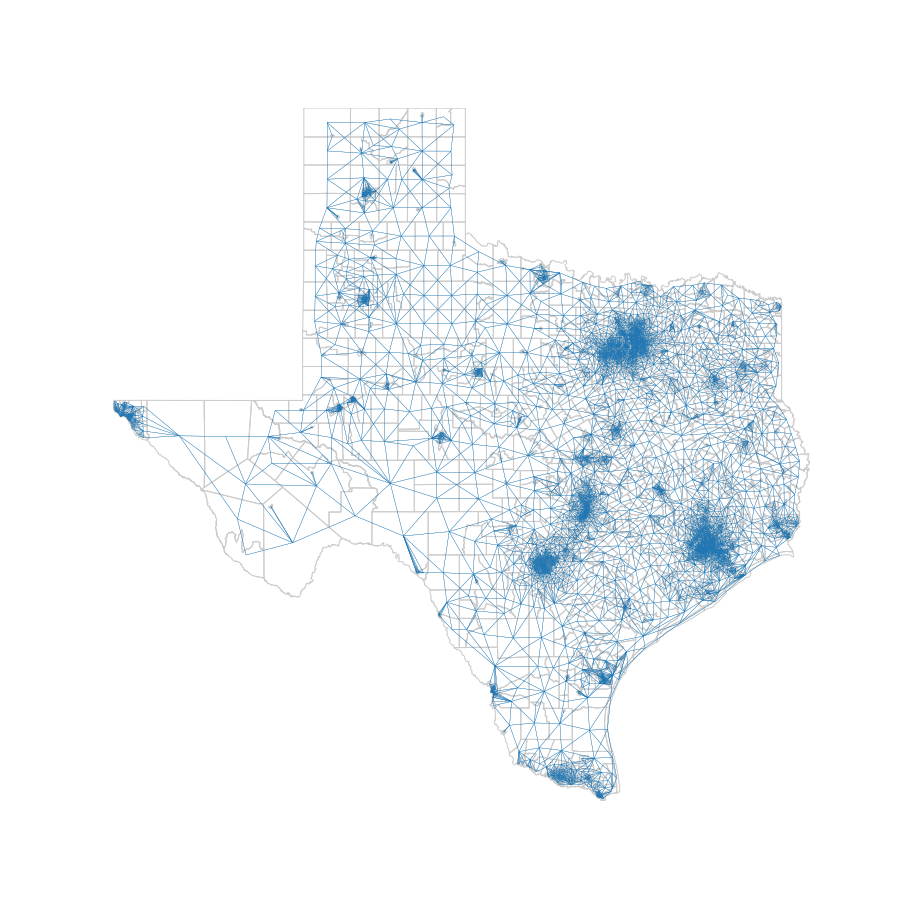
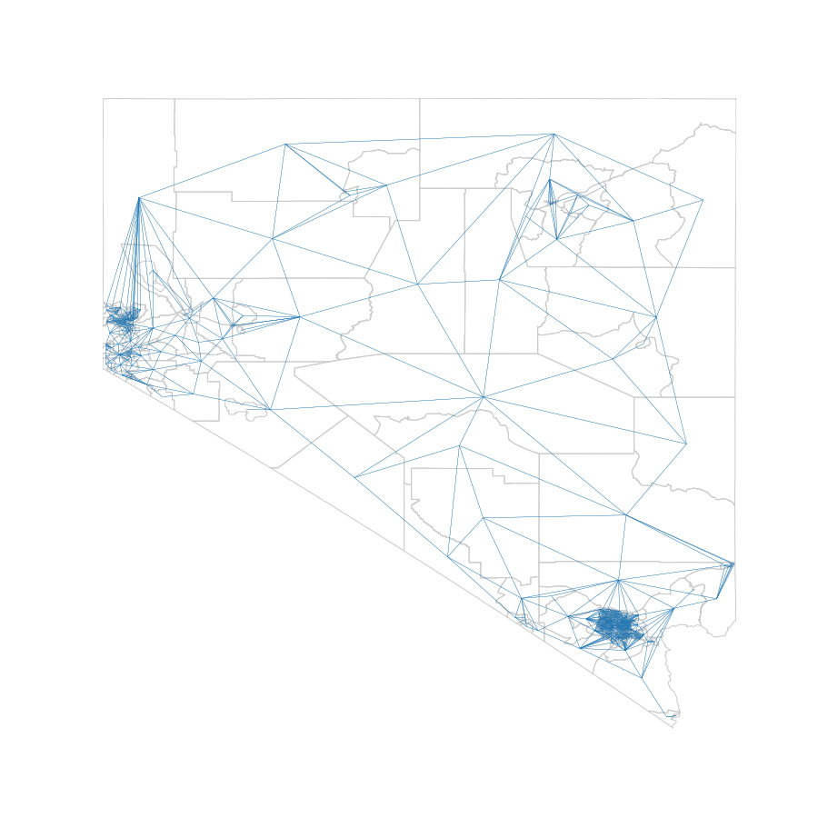

# Census Data Mapping Project
The code used in this project was used to create adjacency graphs and other data structures to model relationships between congressional districts, census tracts, and other census units and subunits. The main functions which can be executed using the code in this project are: creating adjacency graphs & matrices, visualizing these data structures, and computing compactness scores and other measures using member and border nodes. The code is also specifically adapted to working with census data and includes ways of labeling and identifying entries based on GEOIDs. The main and most useful functions have been formalized and documented in district_node_computation_library.py

## Getting Started
These instructions will get you a copy of project code up and running on your machine for development, data analysis, and testing purposes. 

### Prerequisites
The following software needs to be installed on your machine. Instructions for installation are included and/or linked to in this section.

#### Python 3.5.x or greater and Anaconda 4.4+ 

Instructions on installing conda can be found here:
https://conda.io/docs/user-guide/install/index.html

#### Packages
You will also need to install the following packages to run the code in this project:

- PySAL
- PyLAB
- Glob
- Collections
- shapely

The recommended method of installation is using Python pip. For instructions on installing python packages using pip, see the instructions linked to below.

Installing pip: https://pip.pypa.io/en/stable/installing/

Installing packages using pip: https://packaging.python.org/guides/installing-using-pip-and-virtualenv/

Installing PySAL and PySAL documentation: http://pysal.readthedocs.io/en/latest/users/installation.html

## Usage
This section describes the code included in this project and possible uses. The code described is in the 'adjacency_graphs_all' folder of the repository.

### Adjacency Graphs and Visualization

The above image is a visualization for the adjacency graphs of the tracts within the states of Texas. The code discussed in this portion can be used to create adjacency graphs for census tracts, blocks and other state sub-units. In implementation, some code shared in the 2014 scipy conference was used. See below for details.


#### Adjacency Graphs
The function used to generate adjacency graphs is 'mggg_twostep' and it can be found in 'district_node_computation_library.py'. It implements the "twostep" algorithm discussed in "Scaling Polygon Adjacency Algorithms to Big Data Geospatial Analysis" by Jason Laura and Sergio J. Rey. As input, it requires a python dictionary who's values are PySAL geometries. To generate such a dictionary from a .shp file and a .dbf file, one could use 'create_polymap', which is found in the same library. The workflow to create an adjacency graph is then:

```
shp_dir = "path/to/some/shp/file.shp"
dbf_dir = "path/to/corresponding/dbf/file.shp"
id_column = "ID"
"""
ID should be the column name associated with the identifier one wishes to use for the data. In the case of census data, it is common to use geographic identifiers, usually labeled as "GEOID".
"""

polymap = create_polymap(shp_dir, dbf_dir, geoid_column)
adjacency_graph = mggg_twostep(polymap)
```

#### Visualization
'visualize_adjacency_graph' will output a visualized adjacency graph for an shp file, such as the one below (generated using an shp file for the census tracts of Nevada).


### Membership Computations
The two computations of interest for this section are the number of member and boundary sub-units for a particular congressional district. Sub-unit here can refer to tracts, blocks, or block groups. The library has one function, 'get_district_member_and_boundary_entities' outputting two lists of lists for both of these computations. Potential data which can be used for such an analysis is discussed in the Data section.

### Other Code
Other code in 'adjacency_graphs_all' includes scripts used to perform the computations and generate graphs discussed in the previous sections. The functionalities of these scripts are implemented in the functions in 'district_node_computation_library.py'.

## Data
The data analyzed using this code was 2013 congressional district TIGER/LINE data and 2010 Census TIGER/LINE data. While accessing the Cartographic Boundary Shapefiles for individual districts via the census website (https://www.census.gov/geo/maps-data/data/cbf/cbf_cds.html) is fairly straightforward, this is harder, if possible, to do for tracts and other Census units. The method used by the team for acquiring this data was accessing the census ftp server at: ftp://ftp2.census.gov/ . Note, however, that the data should also be accessible via web at: https://www2.census.gov/ .

### Accessing an FTP server 
Instructions on how to access an ftp server via the command-line can be found in the following link: 
http://www.dummies.com/software/how-to-use-ftp-from-terminal-to-transfer-mac-files/

### Accessing Census Congressional District Data
To access congressional district shapefile data via the ftp server, use the following lines from your command-line (note this would work for OSX/Unix Operating Systems).
```
ftp ftp://ftp2.census.gov/
> cd geo/tiger/TIGER2013/cd
```
from here, desired data can be downloaded following the instructions in the previous section.

### Accessing Census Tract Data
```
ftp ftp://ftp2.census.gov/
> cd geo/tiger/TIGER2010/TRACT/2010
```
from here, desired data can be downloaded following the instructions in the previous section.

## Author
Alejandro Velez

## Collaborator
Sarah Von Ahn (note a lot of the code not discussed in the readme belongs to her)

## Other Acknowledgements
Justin Solomon - supervisor
Moon Duchin, Mira Bernstein - MGGG project
Gabriel Ramirez, Ria Das - fellow undergraduate researchers
Richard Barnes - helped with understanding how to access census data
